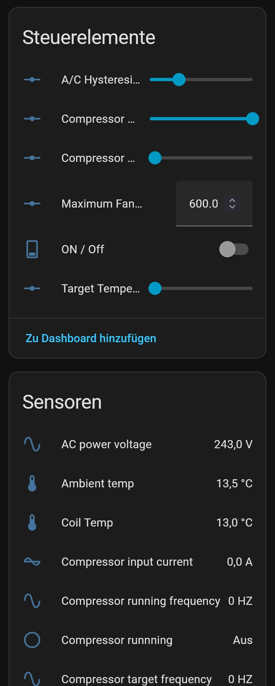
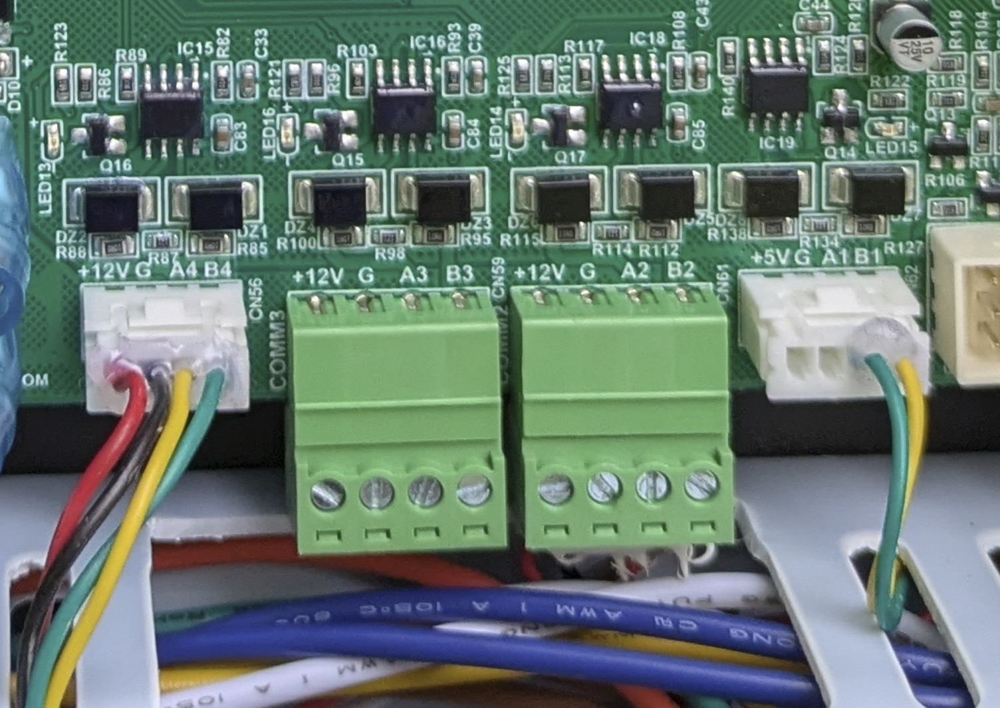

# Hofman Energy AVARMA Home Assistant Integration
Home Assistant Integration for Hofman Energy AVARMA Heat Pumps

This Repository contains Informations and Code for integrating the Hofman Energy AVARMA Heat Pumps into Home Assistant.

Most Documentation is in German for now as these Heatpumps are mostly used in Germany and Austria.

## Hardwareanbindung

Die AVARMA Wärmepumpen besitzen mehrere RS-485 Schnittstellen von denen sich zwei zur Anbindung an Home Assistant eignen.

- COMM 1: (im Bild rechts) RS-486 Schnittstelle wird intern verwendet
- COMM 2: RS-485 Schnittstelle auf der die Wärmepumpe als Master kommuniziert. Diese Schnittstelle ist auf PIN 11 + 12 der Klemmleiste aufgelegt. Kann NICHT für die Kommunikation mit der Wärmepumpe verwendet werden.
- COMM 3: RS-485 Schnittstelle die normalerweise nicht verwendet wird. Über dieser Schnittstelle kann man uneingeschränkt mit der Wärmepumpe kommunizieren.
- COMM 4: (im Bild Links) RS-485 Schnittstelle an der das Display / Bedienterminal angeschlossen ist. Diese Schnittstelle kann zur kommunikation mit der Wärempumpe verwendet werden wenn entweder das Display nicht verwendet wird oder einige RS-485 tricksereien verwendet werden.

Idealerweise verkabelt man die Schnittstelle COMM 3 irgendwo ins Haus wo man ein Modbus Gateway oder einen ESP unterbringen kann. Sollte das nicht möglich sein kann man einen ESP parallel zum Display anschließen, das braucht dann aber einige tricksereien auf dem Modbus.

## Home Assistant Integration
Die Kommunikation mit Home Assistant kann entwerder direkt über die Modbus Integration erfolgen oder über ein zwischengeschaltetes ESP32 / ESPHome Modul.

### Einbindung per ESPHome
[ESPHome Einbindung](README_HA_ESPHOME.md)

### Einbindung per ModBus direkt in Home Assistant

[Modbus Einbindung](README_HA_MODBUS.md)

## Modbus Register der AVARMA Wärmepumpe
[Modbus Register](https://github.com/auenkind/esphome/blob/dev/esphome/components/hofman_energy_avarma/AVARMA_REGISTERS.md)